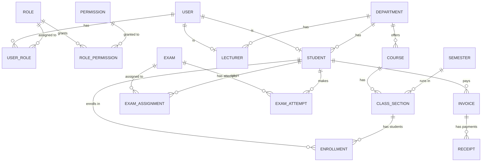

# Thiết kế Cơ sở dữ liệu (Database Design) - EduConnect

## 1. Tổng quan

EduConnect sử dụng cơ sở dữ liệu quan hệ **PostgreSQL** kết hợp với **Prisma ORM** để định nghĩa schema và quản lý migrations. Prisma cung cấp Type-safe database access, giúp giảm thiểu lỗi trong quá trình thao tác dữ liệu từ Backend NestJS.

## 2. Sơ đồ thực thể liên kết (Entity Relationship - ERD)

Dưới đây là một sơ đồ ER rút gọn thể hiện các Domain cốt lõi của hệ thống:

## 3. Các thực thể chính theo Domain

### 3.1. Phân quyền và Danh tính (Identity & Access Management)

- **User**: Lưu thông tin đăng nhập cốt lõi (email, mật khẩu băm, trạng thái).
- **Role & Permission**: Cấu trúc RBAC động. Một User có thể có nhiều Role. Mỗi Role có nhiều Permission.
- **Student**: Kế thừa/Tham chiếu từ User. Chứa thông tin nghiệp vụ sinh viên (Mã SV, Khóa, Lớp sinh hoạt, Khoa).
- **Lecturer**: Kế thừa/Tham chiếu từ User. Chứa thông tin nghiệp vụ giảng viên (Mã GV, Học hàm, Chuyên ngành).

### 3.2. Quản lý Đào tạo (Academic & Enrollment)

- **AcademicYear / Semester**: Cấu trúc năm học và học kỳ.
- **Department**: Đơn vị quản lý hành chính (Khoa).
- **Course**: Môn học chuẩn trong chương trình đào tạo.
- **ClassSection**: Lớp học phần được mở trong một Học kỳ cụ thể.
- **Enrollment**: Đăng ký học (Bảng nối nhiều-nhiều giữa Sinh viên và Lớp học phần).
- **Grade**: Lưu trữ điểm thành phần, điểm tổng kết môn.

### 3.3. Kỳ thi & Ngân hàng Câu hỏi (Exam & Question Bank)

- **Question**: Ngân hàng câu hỏi thuộc về một Course.
- **Exam**: Kỳ thi (online) được tạo ra.
- **ExamQuestion**: Cấu trúc đề thi (Bảng nối Exam và Question, quản lý điểm và thứ tự hiển thị).
- **ExamAssignment**: Phân công sinh viên vào kỳ thi.
- **ExamAttempt**: Lượt thi của sinh viên, lưu trữ thời gian bắt đầu/kết thúc, điểm số, và trạng thái auto-save.

### 3.4. Tài chính học vụ (Finance)

- **FeeType & TuitionRate**: Danh mục các loại phí và định mức học phí theo tín chỉ/học kỳ.
- **Scholarship**: Chính sách miễn giảm học phí.
- **Invoice**: Hóa đơn cần thanh toán.
- **Receipt**: Biên lai xác nhận thanh toán (có thể liên kết hóa đơn hoặc nộp lẻ).
- **PaymentTransaction**: Giao dịch qua cổng thanh toán (nếu tích hợp).

### 3.5. Thông báo & Hỗ trợ (Communication)

- **Announcement**: Thông báo từ nhà trường, phòng ban đến các đối tượng cụ thể.
- **ServiceRequest**: Yêu cầu hỗ trợ (vd: cấp bảng điểm, xác nhận sinh viên) theo quy trình (Open -> In Progress -> Resolved).

## 4. Đặc tả ràng buộc và Thiết kế

- **Soft Delete**: Các bảng quan trọng như Course, Department, User có trường `status` lưu trạng thái (ACTIVE, DELETED) thay vì xóa vật lý, đảm bảo toàn vẹn dữ liệu tham chiếu (Referential Integrity).
- **Unique Constraints**: Sử dụng Index và Constraint chặt chẽ (vd: `studentCode`, `email`, `examCode` phải duy nhất).
- **Auditing**: Mọi bảng (trừ các bảng N-N thuần túy) đều có `createdAt` và `updatedAt`.
- **Soft Delete Mapping**: Không thiết kế cột `deletedAt`, sử dụng `status = DELETED`. Mọi query liên quan đến danh sách đều phải lọc theo `status`.

## 5. Redis Database

- Sử dụng làm In-memory Caching để tối ưu hiệu năng đối với các dữ liệu ít thay đổi (Ví dụ: Menu hệ thống, Danh sách Semesters hiện hành).
- Có thể mở rộng dùng làm Session Store hoặc Message Broker (BullMQ) cho các Background Jobs (gửi email, chấm điểm hàng loạt).
