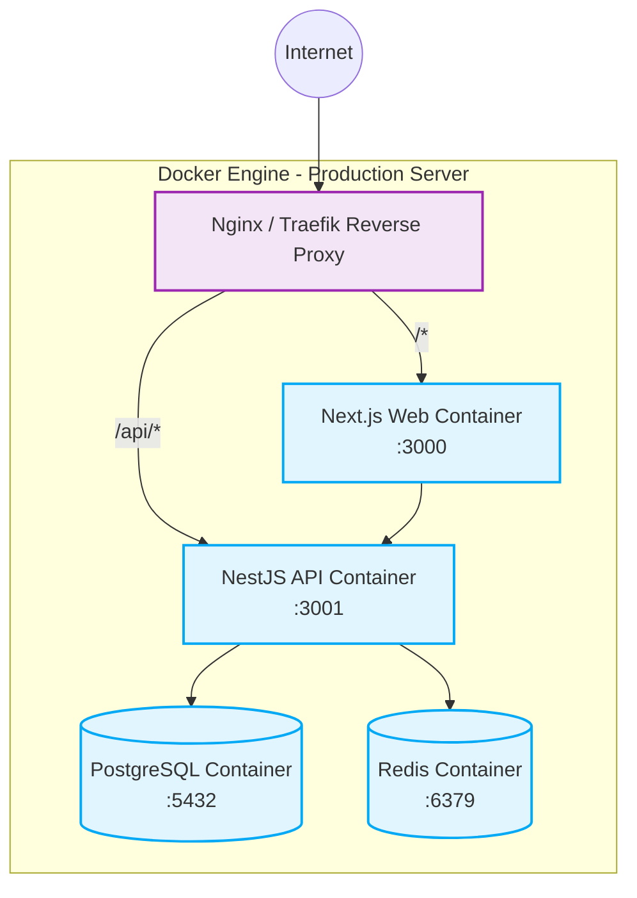

# Kiến trúc Triển khai (Deployment Architecture) - EduConnect

## 1. Môi trường triển khai

Dự án được thiết kế để triển khai dễ dàng thông qua **Docker & Docker Compose**, hỗ trợ cấu hình đa môi trường:

- **Development**: Chạy local, sử dụng `docker-compose.yml` (hoặc Local Docker cho Database/Redis + Node.js CLI cho code).
- **Staging/Production**: Chạy trên máy chủ (VPS/Cloud) thông qua `docker-compose.production.yml`. Mọi thành phần đều được container hóa.

## 2. Các Container Services

Trong môi trường Production, hệ thống gồm các service sau:

1. **Next.js Web (Frontend)**: Bundle Production (chạy trên Node.js hoặc PM2 bên trong container). Export port 3000.
2. **NestJS API (Backend)**: Đã biên dịch ra JS. Export port 3001.
3. **PostgreSQL**: Database server lưu trữ dữ liệu chính. Sử dụng volume persistent `postgres_data`.
4. **Redis**: Cache server. Sử dụng volume persistent `redis_data`.

## 3. Sơ đồ Triển khai (Deployment Diagram)

## 4. Quy trình CI/CD (Continuous Integration / Continuous Deployment)

- Mọi Push/Pull Request vào nhánh chính sẽ kích hoạt quy trình CI (có thể chạy qua GitHub Actions hoặc GitLab CI).
- **CI Steps (Quality Gates)**:
  1. Setup Node.js.
  2. `npm ci` (Install dependencies).
  3. `npm run format:check` (Prettier).
  4. `npm run lint` (ESLint).
  5. `npm run typecheck` (TypeScript Tsc).
  6. `npm run test` (Unit/Integration Tests).
  7. Lệnh build: `npm run build`.
- **CD Steps**:
  1. Build Docker images: `docker build -f Dockerfile.web ...`
  2. Push image lên Container Registry.
  3. Server kéo image mới nhất về, chạy `prisma migrate deploy` để cập nhật Database schema.
  4. Dùng `docker-compose up -d` để reload server không downtime (hoặc minimal downtime).

## 5. Cấu hình bảo mật và Logging

- Không run container bằng user `root`. Khuyến nghị tạo user `node` bên trong Dockerfile.
- Đặt `restart: unless-stopped` cho các services để tự phục hồi khi crash.
- Cấu hình Log Rotation trong Docker Compose để tránh đầy ổ đĩa (VD: max-size 50m, max-file 3).
