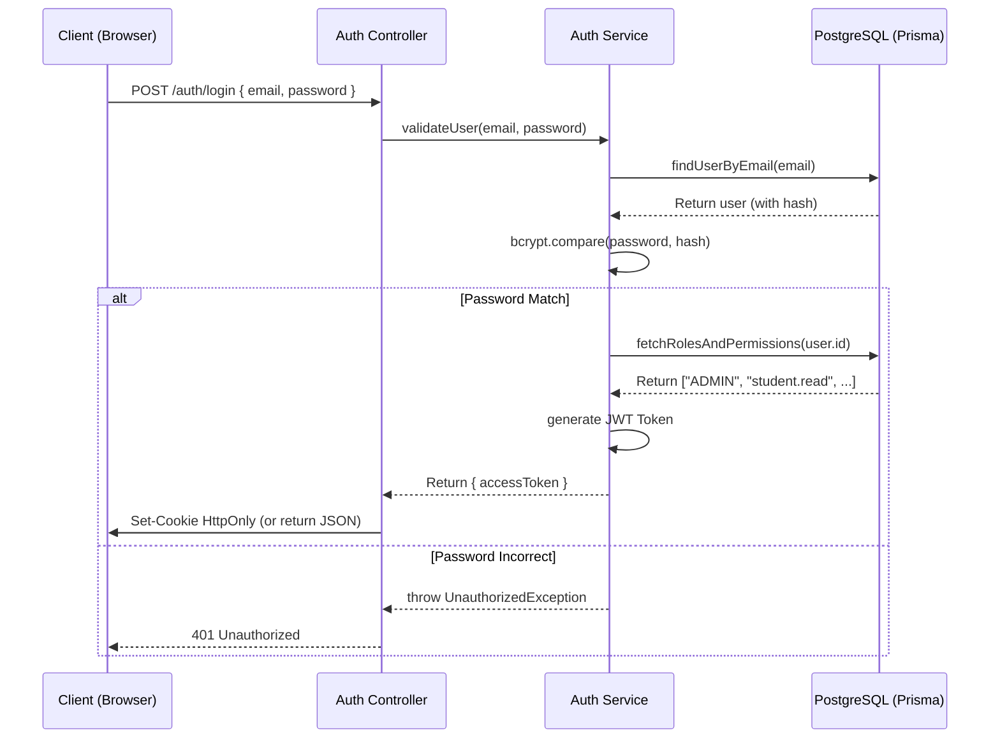

# Kiến trúc Bảo mật (Security Architecture) - EduConnect

## 1. Tổng quan các lớp bảo mật

Hệ thống EduConnect bảo vệ dữ liệu ở cả 3 mức:

1. **Network Layer**: Triển khai behind NGINX Reverse Proxy, HTTPS (nếu deploy public), CORS Config, Rate Limiting.
2. **Application Layer (API)**: Helmet (Security headers), Global Validation Pipe (Tránh NoSQL/SQL Injection gián tiếp, XSS), JWT Authentication.
3. **Data Layer**: Băm mật khẩu bằng `bcryptjs` (salt rounds = 12). Prisma ORM tự động map variables, chống SQL Injection tự nhiên.

## 2. Mô hình phân quyền RBAC & Permissions

Hệ thống không hardcode "role" trực tiếp vào logic kiểm tra, mà sử dụng cơ chế Dynamic Permissions.

- **Roles**: Admin, Training Staff, Finance Staff, Lecturer, Student.
- **Permissions**: Danh sách chuỗi định danh hành động (e.g., `student.read`, `exam.manage`, `invoice.issue`).
- **Hoạt động**: Khi User đăng nhập, API Server lấy danh sách các Permissions được liên kết với Role của User đó và gói vào trong token.

### 2.1. Cấu trúc Token (JWT Payload)

```json
{
  "sub": "uuid-of-user",
  "email": "user@school.local",
  "roles": ["STUDENT"],
  "permissions": ["student.read", "grade.read", "invoice.read"]
}
```

## 3. Luồng xác thực (Authentication Sequence)



## 4. Quản lý Ownership (Resource Authorization)

Ngoài kiểm tra Permission (`@RequirePermissions('exam.manage')`), hệ thống kiểm tra bổ sung **Ownership**:

- **Giảng viên**: Chỉ được sửa/xóa/phân công kỳ thi (Exam) do chính giảng viên đó tạo (`createdByUserId === currentUser.id`).
- **Sinh viên**: Không được xem chi tiết câu hỏi (đáp án đúng) trong kỳ thi trừ khi trạng thái là đã nộp bài VÀ kỳ thi đó cho phép xem lại kết quả (`showResult = true`). Sinh viên chỉ xem được Hóa đơn (`Invoice`) của chính mình.

## 5. Middleware & Security Best Practices

- **Cookies HttpOnly**: Khuyến nghị dùng cho môi trường production nếu Client và Server chạy chung domain.
- **Data Redaction**: Logger của hệ thống (Winston/Pino) được cấu hình không log các trường nhạy cảm (`password`, `token`, `secret`).
- **Rate Limiting**: NestJS `@nestjs/throttler` giới hạn số lượng request từ một IP để chống Brute-force vào endpoint `/auth/login`.
- **Validation**: Bắt buộc sử dụng `class-validator` với tùy chọn `whitelist: true` và `forbidNonWhitelisted: true` để lọc bỏ mọi payload không mong muốn từ Client gửi lên.
